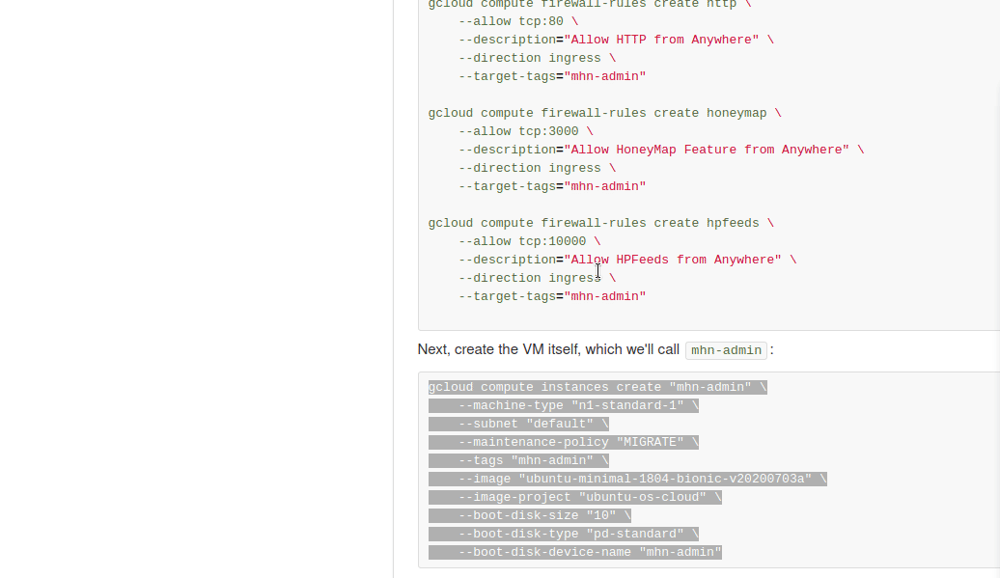
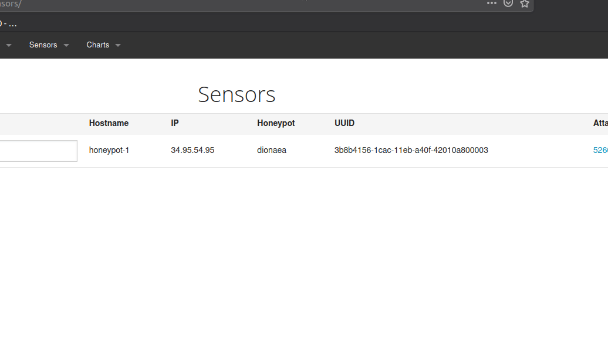

# attackvm

# Honeypot Assignment

**Time spent:** **25** hours spent in total

**Objective:** Create a honeynet using MHN-Admin. Present your findings as if you were requested to give a brief report of the current state of Internet security. Assume that your audience is a current employer who is questioning why the company should allocate anymore resources to the IT security team.

### MHN-Admin Deployment (Required)

**Summary:** The MHN-Admin VM was deployed using google's cloud platform.I used an ubuntu bash shell to execute the commands given,and deploy the vms fast and efficiently.

### Dionaea Honeypot Deployment (Required)

**Summary:** dionaea is a honeypot that is able to be installed in a vm on top of ubuntu or run on a rasberry pi.Its code is open and can be viewed online and provides an easy honeypot for testing.This honeypot is able to be accessed by the ports that were opened when the mhn-admin was deployed.This virtual honeypot is a very accurate representation of the security threats that the company faces by having these ports opened.

### Database Backup (Required) 

**Summary:** What is the RDBMS that MHN-Admin uses? What information does the exported JSON file record?

The RDBMS that MHN-Admin uses is the relational databases mongo-db.It has very flexible cli commands and is able to export the infomration to a json file.The json file records information from the attacks such as the ip address of the source what protocol was used and various other information.

*Be sure to upload session.json directly to this GitHub repo/branch in order to get full credit.*

## Notes

Most of the challenges encountered while doing this project were from not knowing how to work with google cloud platform and learning the new commands.I am very happy that i was able to complete this challenge because it incorporates alot of useful information while providing a good way to practice new skills.
